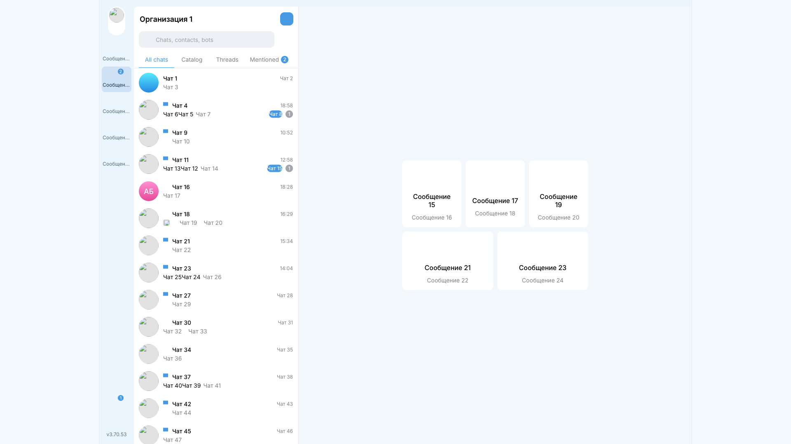
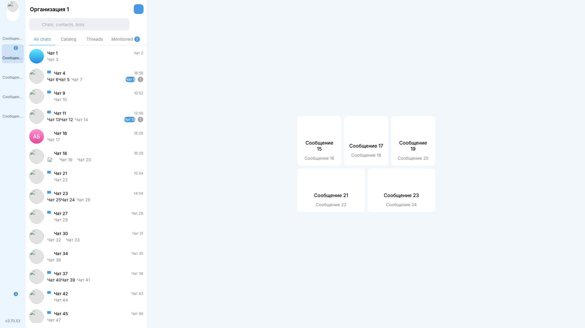
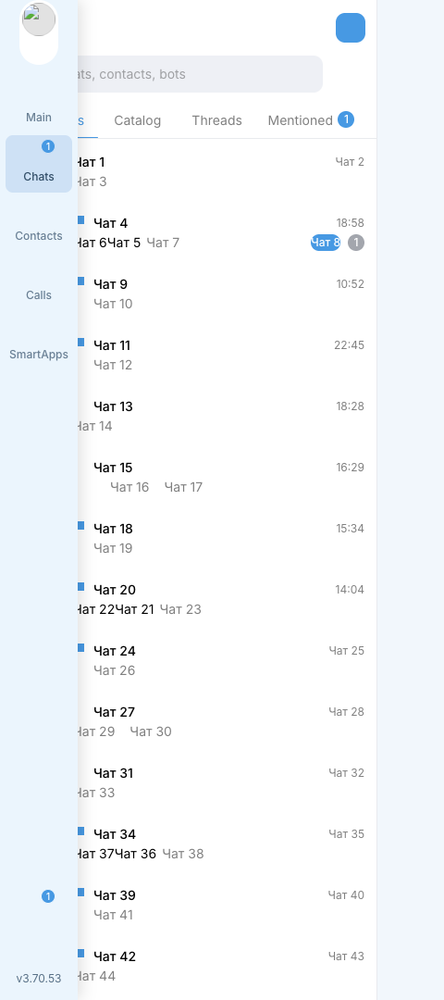
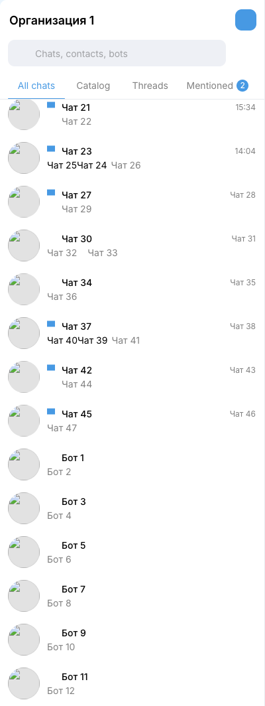
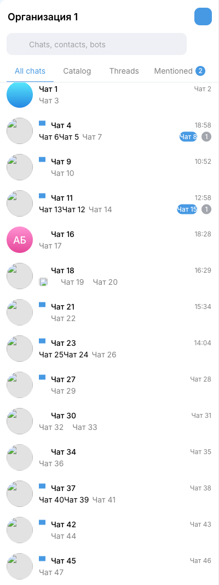

# Better Clouds

> **Неофициальное расширение, не связано с разработчиками Клаудс.**
> Это личный проект. Разработчики web-клиента его не поддерживают и за него не отвечают.

Расширение для Chrome, которое меняет внешний вид web-клиента Клаудс на `https://clouds.org.ru/`.
Оно работает только на этом адресе, ничего никуда не отправляет и не читает переписку.

## Что делает

Функции, у каждой из которых свой тумблер в попапе. Изменения применяются сразу, без перезагрузки вкладки.

### Растянуть на весь экран

Убирает поля по бокам и отступ сверху.

До:



После:



### Прятать левую колонку

Колонка навигации выезжает при наведении на левый край. Пока курсор в стороне, у края видна узкая полоса,
на ней отмечены непрочитанные уведомления.



### Секции тулбара

Прячет секции колонки навигации по отдельности: в попапе под тумблером раскрывается список с переключателем
на каждую секцию. «Main», «Чаты», «Контакты», «Звонки», SmartApps и блок умных приложений скрыты по умолчанию.

Два пункта относятся к колокольчику внизу колонки. «Счётчик колокольчика» прячет число непрочитанных уведомлений,
«Колокольчик» прячет кнопку целиком. Оба пункта по умолчанию выключены, у уже сохранённых настроек они тоже не скрыты.
Если скрыт любой из них, точка непрочитанных на полосе спрятанной колонки перестаёт реагировать на уведомления:
иначе она напоминала бы о том, что пользователь решил не видеть. Кнопка сворачивания колонки рядом не затрагивается.

### Скрыть ботов из каталога

Не показывает во «Все чаты» ботов, с которыми нет переписки. На вкладке «Каталог» и в поиске они остаются.

В свёрнутом режиме списка чатов, который включается нижней кнопкой колонки навигации, боты из каталога снова видны:
в этом режиме клиент не выводит признак каталожной записи, по которому работает скрытие. Как только список
возвращается в обычный режим, боты снова скрыты.

До:



После:



Снимки сделаны на обезличенной странице: имена, тексты и аватары заменены на заменители.

### Время под картинками и видео

Время и статус прочтения сообщения с картинкой или видео выводятся под превью, а не поверх него. У текстовых сообщений
и у длительности внутри видео вид не меняется. По умолчанию выключено.

## Установка из zip

Расширения нет в Chrome Web Store, оно ставится распакованной папкой.

1. Открыть [страницу релизов](https://github.com/conarti/better-clouds/releases) и скачать у последнего релиза
   файл `better-clouds-<version>-chrome.zip`, например `better-clouds-0.1.0-chrome.zip`.
   Архивы «Source code» не подходят: в них исходный код, а не собранное расширение.
   Если у свежего релиза файла ещё нет, он появится через несколько минут: сборка идёт после публикации.
2. Распаковать архив в постоянную папку, например `~/Applications/better-clouds`.
   Chrome читает файлы из этой папки при каждом запуске, поэтому после установки её нельзя удалять и переносить.
3. Открыть `chrome://extensions`.
4. Включить «Режим разработчика» справа сверху.
5. Нажать «Загрузить распакованное» и выбрать папку с распакованными файлами (внутри должен лежать `manifest.json`).
6. Нажать на значок расширений в панели Chrome и закрепить Better Clouds, чтобы попап открывался в один клик.
7. Открыть или перезагрузить вкладку с клиентом.

## Обновление

1. Скачать zip нового релиза.
2. Распаковать его **в ту же папку**, заменив файлы. Новая папка означает новую установку: старую пришлось бы удалять вручную.
3. На `chrome://extensions` нажать «Обновить» на карточке расширения.
4. Перезагрузить открытые вкладки Клаудс.

Пока вкладка не перезагружена, старая версия на ней отключается сама и возвращает странице исходный вид.

## Выключение отдельных функций

Значок расширения открывает попап со списком функций. Тумблер выключает функцию на всех открытых вкладках сразу,
перезагружать страницу не нужно. Настройки хранятся в профиле Chrome и синхронизируются вместе с ним.

Чтобы выключить расширение целиком, достаточно снять переключатель на его карточке на `chrome://extensions`.

## Совместимость функций

Функции независимы и работают в любом сочетании.

- При выключенном «Растянуть на весь экран» окно приложения остаётся по центру, а полоса спрятанной колонки
  видна у левого края этого окна, а не у края экрана.
- На сенсорных устройствах без наведения курсора (`hover: none`) колонка навигации не прячется и остаётся на месте:
  иначе до неё нельзя было бы дотянуться.
- Если в системе включено уменьшение анимаций, колонка появляется и скрывается без плавного перехода.

## Темы

Расширение не задаёт своих цветов и берёт их из переменных клиента, поэтому вид совпадает с выбранной темой.
Проверено во всех темах клиента.

## Приватность и разрешения

- Единственное разрешение это `storage`: в нём хранятся положения тумблеров.
- Доступ к страницам ограничен адресом `https://clouds.org.ru/*`, на других сайтах расширение не запускается.
- Расширение не делает сетевых запросов, не собирает статистику, не читает и не отправляет переписку.
- Код меняет только те элементы, атрибуты и стили, которые создал сам.

## Если не работает

- Корпоративная политика Chrome может запрещать режим разработчика или распакованные расширения.
  В этом случае карточка расширения выключается сама или не появляется вовсе, и обойти это из расширения нельзя.
- Проверенная версия клиента: v3.70.53. Номер виден внизу колонки навигации.
- Минимальная версия Chrome: 111.
- Клиент обновляется, и после обновления функции могут перестать действовать: расширение опирается на разметку страницы.
  Сайт при этом выглядит так же, как без расширения, данные не теряются.
- Если на `chrome://extensions` одновременно включены две копии расширения (например установленная и dev-сборка),
  в консоли вкладки появляется предупреждение с префиксом `[better-clouds]`. Нужно оставить включённой одну копию.

## Разработка

```bash
pnpm install
pnpm exec playwright install chromium
pnpm dev
```

`pnpm dev` собирает расширение в `.output/chrome-mv3-dev` и следит за файлами. Встроенный запуск браузера не используется:
он открывает чистый профиль без авторизации, поэтому dev-сборку удобнее загрузить в основной профиль тем же способом,
что и обычную установку. **На время разработки установленную версию нужно выключить** на `chrome://extensions`:
обе копии меняют одну и ту же страницу.

Остальные команды:

| Команда             | Что делает                                        |
| ------------------- | ------------------------------------------------- |
| `pnpm test`         | тесты: unit на happy-dom и браузерные на Chromium |
| `pnpm lint`         | ESLint и проверка текстов                         |
| `pnpm type-check`   | проверка типов                                    |
| `pnpm format:check` | проверка форматирования                           |
| `pnpm build`        | production-сборка в `.output/chrome-mv3`          |
| `pnpm zip`          | архив расширения в `.output`                      |
| `pnpm icons`        | перерисовка значков из `design` в `public/icons`  |

## Как добавить функцию

1. Создать папку `src/features/<id>/` и в ней:
   - `meta.ts`: идентификатор, название и описание для попапа;
   - `styles.ts`: именованный экспорт `featureStyles` со стилями функции;
   - `content.ts`: контракт функции, стили, якорные селекторы и `mount`, если нужен JS;
   - `settings.ts`: только если функции нужна своя схема хранения.
2. Добавить одну строку в `featureMetaRegistry` в `src/features/registry.ts`. Порядок строк задаёт порядок тумблеров.
3. Все селекторы и имена атрибутов клиента держать в `src/shared/site/selectors.ts`, а не в коде функции.
4. Снять фрагмент разметки по процедуре из `tests/fixtures/README.md` и написать браузерный тест на этом фрагменте.

`meta.ts` и `settings.ts` попадают в попап, поэтому в них не должно быть Vue, CSS, DOM, селекторов клиента
и побочных эффектов на верхнем уровне модуля. Границы проверяются линтером и тестами.

## Релизы

История и версии ведутся автоматически. Заголовки коммитов в формате conventional commits (`feat:`, `fix:`, `docs:`),
release-please собирает из них CHANGELOG и release PR, а после его вливания публикует релиз с тегом и архивом расширения.

## Лицензия

[MIT](LICENSE).
